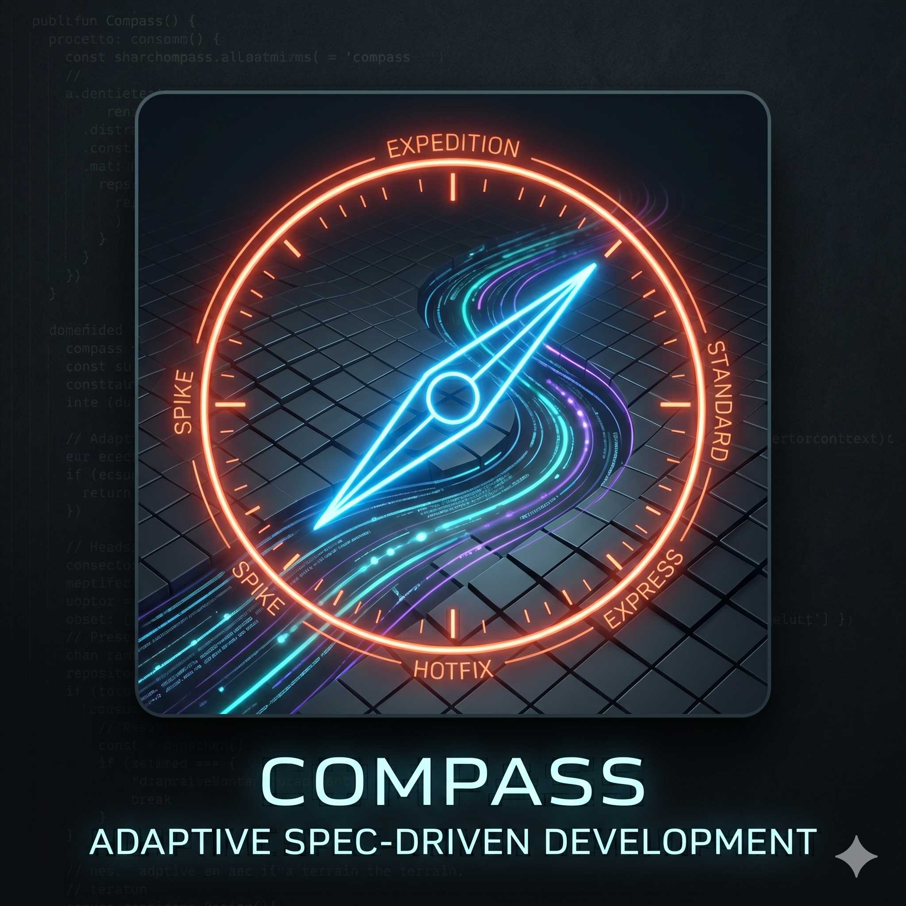

<p align="center">
  
</p>

# Compass - Adaptive Spec-Driven Development

**Assess the work. The policy does the routing.**

Compass is a spec-driven development framework that refuses to treat a typo fix
and a payments rewrite the same way. It reads the context of each issue - how
risky, how big, new code or old, who's asking - and computes the right amount
of process for *that* change. Heavy when it needs to be. Out of the way when it
doesn't.

Built for Claude Code. The methodology and the CLI are tool-agnostic, so it
ports; only a thin adapter layer is Claude-Code-specific.

---

## The problem

Every spec-driven framework eventually picks a ceremony and applies it to
everything. Then one of two things happens:

- The process costs more than the change, so people route around it. It gets
  used for the demo and abandoned for the real work.
- The same flat process that's too heavy for a typo is too *light* for a
  schema migration. You can't calibrate one fixed pipeline for both ends.

The usual fix is *levels* - a fixed ladder of five or six tiers. Better, but a
ladder is a one-dimensional answer to a multi-dimensional question. "How risky"
and "how big" and "is this greenfield" and "who's invoking" are different axes.
A migration that touches one file is small but not safe. A prototype is large
but low-risk.

## The idea

Compass computes process intensity per issue instead of selecting it from a
menu. Every issue starts with **triage**, where the evaluator
reads four dimensions:

| Dimension | Question |
|---|---|
| **risk** | If this goes wrong, how bad and how wide? |
| **Familiarity** | New code or existing code - and how well is it mapped? |
| **Size** | How much work is this actually? |
| **Intent & role** | Who's invoking, and what outcome are they really after? |

Triage writes `delivery-approach.md`: what it assessed, the approach it computed, the gates
that apply, and **exactly what it's skipping and why that's safe**. De-scoping
is a written, auditable decision, never an accident.

## Quick start

The fastest path is the plugin marketplace. No clone, no install script:

```bash
# In Claude Code:
/plugin marketplace add jed72/compass
/plugin install compass@compass
pip install pyyaml      # the CLI's one dependency
```

Enabling the plugin namespaces the commands as `/compass:…`, registers the
hooks, and puts the `compass` CLI on your PATH.

Then start an issue. The default guardrails ship active, so triage frames it
and picks the route with no setup at all:

```bash
/compass:triage "Add rate limiting to the public API"

# Walk the pipeline (or let the route auto-advance).
/compass:define
/compass:design
/compass:implement
/compass:verify
/compass:ship

# Optional, whenever you have opinions to encode. Not a prerequisite:
/compass:init   # adopt project guardrails and strategies into governance/
```

A product owner would instead start with `/compass:intent`, a marketer with
`/compass:position`. To see across every issue in flight - triage, blockers, the
periodic digest - run `/compass:flow`. See
[`docs/quickstart.md`](docs/quickstart.md).

<details>
<summary>Installing from source instead</summary>

`scripts/install.sh` wires the slash commands, agents, skills, and hooks in by
symlink, so edits to your clone are picked up live:

```bash
git clone https://github.com/jed72/compass.git
cd compass && bash scripts/install.sh --global
pip install pyyaml
```

Unlike the plugin, this does **not** modify your PATH. To make `compass`
invokable from your shell, add `$PWD/bin` to your `PATH`, or invoke it as
`python3 $COMPASS_HOME/cli/compass`. The slash commands run the CLI on your
behalf, so this only matters when you call it directly.

</details>

## One pipeline, adaptive depth

Every route runs the same eight phases. What changes is how much each one
costs.

```
triage → define → refine → design → breakdown → implement → verify → ship
```

On a **quick fix**, the requirements review, the design stage, and the
breakdown collapse to almost nothing. On an **initiative**, the design
stage produces a distribution map and the breakdown
spins up a swarm of agents across git worktrees. Same vocabulary, different
weight, so anyone who has run one Compass issue can read the artifacts of any
other.

## The five reference shapes

Approaches are *composed* from the dimension assessment. These five are starting
shapes triage tunes, not a fixed ladder.

| Route | Typical reading | Shape |
|---|---|---|
| **quick fix** | atomic · contained · mapped | triage → define (1 scenario) → implement → verify. Still tested before it ships. One gate. |
| **feature** | standard · contained | Full pipeline, solo or pair. Two gates. |
| **initiative** | large · cross-cutting · greenfield | Full weight. Governance check, BDD discovery, distribution map, agent swarm across worktrees. All gates. |
| **Hotfix** | critical · small · brownfield | Reproduce first: a failing regression test is the spec. Expedited implementation, mandatory post-incident follow-up. All Verify gates. |
| **Spike** | intent is exploration | Explore freely: the TDD strategy is suspended, the hook doesn't block. Then graduate (re-assess into a real route) or discard. **Nothing ships from a spike.** |

## Governance - guardrails and strategies

Compass is governed by two kinds of thing, kept deliberately separate:

- **Guardrails** are few, hard, checkable, blocking. The things that must never
  happen. Triage adapts ceremony *around* them; it never crosses one.
- **Strategies** are many, soft, directional, assessed. How the team tends to
  work. A strategy biases a decision; it doesn't block one.

The framework ships five **default guardrails**: tested before it lands,
acceptance defined before it's built, traceability holds, evidence not
assertion, and a human signs off on the irreversible.

The move that keeps Compass from being a sledgehammer: **BDD and TDD are
default *strategies*, not guardrails.** The hard line is the *outcome* - code
is tested, acceptance is checkable. Given/When/Then and red-green-refactor are
the strong, shipped-on *way* to get there, and a spike can suspend
them. A one-line typo fix still has to be tested before it lands; it doesn't
have to perform the full ritual to do so.

Governance is a **gradient, not a threshold**: the defaults ship active, so
`/compass:init` is optional and `/compass:triage` works on day one. A team
*accretes* its own strategies as it forms opinions. See `governance/`.

## Roles are full citizens - one spec, many roles

Compass isn't an engineering framework with bolted-on hooks for everyone else.
The non-engineering roles have their own entry points and artifacts that plug
into the *same* pipeline. The shared BDD scenario file is what makes it work.
Every role reads it through their own perspective:

| Role | Entry point | Reads the spec for… |
|---|---|---|
| Product owner / manager | `/compass:intent` | intent fidelity - do these scenarios deliver the brief? |
| Product marketer | `/compass:position` | claims - every line of launch copy points at a backing scenario |
| Designer | `/compass:wireframe` | UI contracts, written as scenarios that flow into the define stage |
| Engineer | `/compass:triage` → pipeline | tests - scenarios become the acceptance suite |
| QA | `/compass:verify` | coverage - which scenarios are exercised, which edges aren't |

The product owner enters *upstream* of the spec. The marketer works *parallel*
to it. The designer feeds *into* it. Nobody is just a downstream consumer of a
finished engineering process.

**A perspective does not always have an entry point.** The table lists the five
**entry-point roles**, each of which starts an issue with its own `/compass:…`
command. The framework ships ten agents rather than five, because some roles
apply *during* the pipeline instead of starting it. The **architect-lens** is
the clearest example: it reads the project's `architecture/` artifacts at triage
and annotates `design.md` at Plan, and is consulted by the spec author and the
planner rather than invoked directly. See
[`docs/roles-guide.md`](docs/roles-guide.md).

## Why the routing is deterministic

An adaptive framework owes an answer to the obvious objection: *if the process
can flex, what stops it flexing to nothing?*

There is a line through Compass. On one side is **judgement**: triage
reading the four dimensions. That cannot be mechanized, and that judgement *is*
the adaptivity. On the other side is **mechanism**: everything that happens
once the assessment exists: composing the delivery approach, applying the
floors and caps, and running the guardrail checks. Same assessment plus
same policy gives
the same route, every time.

Compass puts that mechanism in a CLI so it is *actually* deterministic rather
than deterministic in principle. Gate evidence in `task.yml` is **typed**, a
`{type, path}` record rather than a bare path, so a mechanical gate cannot be
cleared with a written note. And `compass retro` is the framework's own
feedback loop: it reads the re-assess log across every issue and reports whether
triage is systematically over- or under-sizing routes. See
[`docs/methodology.md`](docs/methodology.md) §6.

---

# Reference

## The compass CLI

The slash commands call the CLI under the hood, so you rarely invoke it
directly. `/compass:triage` runs `compass approach evaluate`; `/compass:verify`
runs `compass check`. It is the part that makes the framework's checks real
rather than aspirational.

```
compass approach evaluate   apply routing-policy.yml to a task's readings → the route
compass check            run the guardrails.yml checks against task.yml + evidence/
compass bdd extract     extract a task's acceptance-criteria.md into a runnable .feature
compass tdd-red   -- CMD run a test, assert it FAILS, record the red
compass tdd-green -- CMD run a test, assert it PASSES, clear the red marker
compass policy lint      structurally validate the governance YAML
compass issue lint        structurally validate a task.yml
compass design lint        scan a design.md for placeholder phrases (TBD, TODO,
                         "implement later") - advisory, always exits 0
compass issue receipt     render a one-screen receipt for a landed task:
                         readings → route → typed evidence → gate verdicts
compass issue set-status  record a task as queued | active | parked | landed |
                         abandoned - the mutator for the lifecycle field
compass acceptance start declare the acceptance for a change with no natural
                         red - a validator (--kind validation) or a green suite
                         to preserve (--kind refactor); record closes it
compass gate pass        flip a gate to pass; validates evidence type at write time
compass scenario add     append a scenario to task.yml
compass changed-file add trace a changed production file to a scenario
compass evidence add     append a typed evidence entry to the registry
compass analyze          cross-artifact coherence check: orphaned scenarios,
                         route disagreements, orphan claims (advisory, or
                         gate-clearing if verify.analyze is in the route)
compass adr new          create a new numbered ADR in architecture/decisions/
compass rework-scan      scan tasks for rework patterns (window from signals.yml)
compass flow [--digest]  cross-task flow view; --digest writes a dated digest
                         with the rework-scan section and calibration signal
compass next             surface the next action on the current task
compass follow-up resolve  mark an outstanding follow-up resolved in task.yml
compass ship-commit -m   commit staged artifacts robustly: survives auto-fixing
                         pre-commit hooks and verifies HEAD advanced
compass retro      aggregate the re-assessment log - is the sizing right?
compass terminology      render the v2 vocabulary - one term or the whole glossary
compass ci               the full mechanical gate suite, for CI - honour the exit code
```

Its only hard dependency is PyYAML. `jsonschema` is optional and turns on full
JSON Schema validation in the lint commands.

## Fitness functions and flaky-test integrity

Two capabilities extend governance without adding to the five hard guardrails.

**Fitness functions as project guardrails.** A project declares a fitness
function in `governance/guardrails.yml` with `check: command-passes` plus the
command to run. `compass check` runs that command at Verify and refuses to
clear the gate unless it exits 0. This lets a team encode "the build is under
N MB", "the API never returns 500 in the smoke suite", or "performance does not
regress past P95 = X ms" *as guardrails* - checkable, blocking, evidence-backed
- without inventing new check types in the framework. The reasoning is recorded
in `architecture/decisions/ADR-009`, which decides that fitness functions
belong to the project rather than the framework.

**Flaky-test integrity.** A test that reruns to green is the classic way a
guardrail becomes silently advisory. The `no-trusted-rerun` rule under
evidence-not-assertion refuses to clear a test run that only passed on a
retry, unless either the root cause is fixed *or* the test is explicitly
quarantined in `governance/quarantine.yml` with a tracking issue. The
intermittency rule in `governance/strategies.md` has the detail.

## Compass CI vs project CI

> Compass CI does not replace your normal project CI. It does not re-run your
> full test suite unless you explicitly configure your pipeline to do so.
> Compass checks whether required evidence exists, is valid, and is traceable
> to the issue route. Your application pipeline should still run tests, linting,
> type checks, security scans, build validation, and deployment checks.

The two are complementary: project CI proves the *code* is correct, Compass CI
proves the *process* - that the route was framed, scenarios have tests, changed
files trace to scenarios, gates carry evidence of the right type, and approvals
are recorded where they must be. Run them as separate jobs in the same
workflow, with `compass-ci` gated on `project-ci`, so a failing test suite
stops the pipeline before Compass even runs:

```yaml
# .github/workflows/ci.yml
name: CI

on:
  pull_request:
  push:
    branches: [main]

jobs:
  project-ci:
    runs-on: ubuntu-latest
    steps:
      - uses: actions/checkout@v4
      # your normal pipeline: tests, lint, type-check, security scans,
      # build validation, deploy checks - whatever your project requires.
      - run: make test
      - run: make lint

  compass-ci:
    runs-on: ubuntu-latest
    needs: project-ci             # only run Compass once the code is green
    env:
      COMPASS_CLI: cli/compass    # adjust to wherever Compass lives in your repo
    steps:
      - uses: actions/checkout@v4
      - uses: actions/setup-python@v5
        with:
          python-version: "3.11"
      - run: pip install pyyaml jsonschema
      - run: python3 "$COMPASS_CLI" ci
```

`ci/github-actions.yml` is the reference workflow for the `compass-ci` job
alone; `ci/README.md` is the full contract. Pin `COMPASS_CLI` to a specific
commit SHA - see `docs/security.md` for the supply-chain stance.

When you are first piloting Compass and do not want it blocking pull requests,
set `mode: advisory` in `.compass/config.yml` and `compass ci` will report
failures without exiting non-zero. Flip to `mode: enforced` when the team is
ready.

## What's in the box

Compass is built in **three layers**. The methodology layer *is* the framework,
in plain markdown. The kit layer is the deterministic mechanism: a plain CLI
with PyYAML as its one dependency, not Claude-Code-specific. The adapter layer
wires both into Claude Code. See [`docs/methodology.md`](docs/methodology.md)
§9.

```
compass/
├── governance/        Guardrails + strategies + routing policy: .md (prose)
│                      AND .yml (the machine-readable governance the CLI runs,
│                      including signals.yml and quarantine.yml)
├── architecture/      The project's cross-task architectural artifacts:
│                      system-context.md, relations.md, ownership.md, and
│                      ADRs in decisions/. Compass ships its own founding ADRs
│                      as a worked example; another project drops its own here
├── approaches/        The sizing rubric (rubric.md) + the 5 reference shapes
├── schemas/           Executable JSON Schema (.schema.json) for the .yml +
│                      task.yml, with human-readable .reference.yml companions
├── cli/               compass - the deterministic CLI (route evaluate, check,
│                      tdd-red/green, lint, calibration, ci); the kit's mechanism
├── bin/               compass - plugin CLI shim that execs cli/compass.
│                      Claude Code adds the plugin's bin/ to PATH when the
│                      plugin is enabled, so `compass <subcommand>` resolves
│                      without a manual symlink or alias
├── ci/                CI integration: the reference workflow + the contract
│                      ("run compass ci, honour the exit code")
├── commands/          Slash commands: the pipeline + role entry points
├── agents/            Subagent definitions, including the swarm orchestrator
├── skills/            Procedural knowledge: routing, BDD, TDD, worktrees…
├── hooks/             Mechanical enforcement of the guardrails + TDD strategy
├── templates/         Artifact templates for every phase and role,
│                      including task.yml, the machine-readable task spine
├── scripts/           install, swarm, integrate, validate
├── .claude-plugin/    Claude Code plugin manifest (plugin.json) +
│                      marketplace manifest - the install path used by
│                      `/plugin install`, parallel to scripts/install.sh
└── docs/              methodology.md is the canonical design doc - start there
```

The methodology layer is `docs/`, `governance/*.md`, `approaches/` and
`templates/`. The kit layer is `cli/`, `governance/*.yml`, `schemas/` and the
`task.yml` spine. The Claude Code adapter layer is `commands/`, `agents/`,
`skills/`, `hooks/` and `CLAUDE.md` - and the commands and agents *call the
kit*.

## Read next

- **[`docs/five-minutes.md`](docs/five-minutes.md)** - the shortest path from
  "what is this" to "I've shipped an issue with it." Start here.
- **[`docs/safety-contract.md`](docs/safety-contract.md)** - the seven things
  Compass 1.0 guarantees, and what it explicitly does *not* claim.
- **[`docs/methodology.md`](docs/methodology.md)** - the canonical design doc.
  Everything else is downstream of it.
- [`docs/quickstart.md`](docs/quickstart.md) - your first issue, per role.
- [`docs/install-smoke-test.md`](docs/install-smoke-test.md) - manual install
  verification checklist.
- [`docs/security.md`](docs/security.md) - hook surface, dependencies,
  supply-chain stance.
- [`docs/routing-deep-dive.md`](docs/routing-deep-dive.md) - how triage
  actually decides.
- [`docs/roles-guide.md`](docs/roles-guide.md) - one scenario, seen four ways.
- [`docs/writing-specs-and-plans.md`](docs/writing-specs-and-plans.md) - the cold-reader strategy
  (write for a cold reader) shown applied to a spec Summary, a design decision,
  a scenario name, and a plan work unit, with what Compass deliberately does not
  adopt and why.
- [`docs/portability.md`](docs/portability.md) - the three layers, and what
  porting Compass to another runtime involves (rewrite the adapter; keep the
  methodology and the kit).
- [`schemas/README.md`](schemas/README.md) - the shape of the machine-readable
  files the CLI reads.

## License

Apache 2.0. See `LICENSE`.
