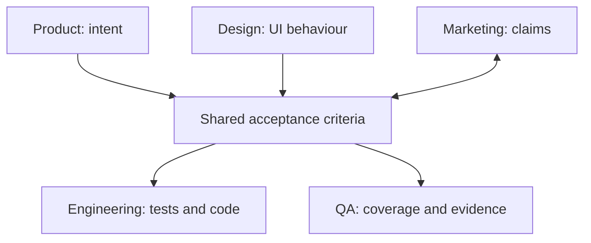

# Roles in Compass

Compass gives product, design, engineering, marketing and QA distinct ways to
enter the same issue. They do not maintain separate specifications.

The shared substrate is `acceptance-criteria.md`: one set of observable
behaviours, read from different professional perspectives.

## Entry points and ownership

| Role | Entry point | Primary artefacts | Governing question |
|---|---|---|---|
| Product owner or manager | `/compass:intent` | `intent.md` | Does the specification deliver the intended outcome? |
| Product marketer | `/compass:position` | `positioning.md`, `launch-readiness.md` | Which claims are supported by verified behaviour? |
| Designer | `/compass:design` | `ui-contract.md` | Are interaction states and accessibility expectations specified? |
| Engineer | `/compass:assess` | approach, design, code and tests | How will each scenario become tested software? |
| QA | `/compass:verify` | `verification-report.md` | Is the behaviour covered, and is the evidence sufficient? |

A role changes the issue's assessment, artefacts and gates. It is not merely a
label for a reviewer added at the end.

## One scenario, five perspectives

Consider a saved-export feature:

```gherkin
Scenario: Finance exports the month-end ledger
  Given a finance user has the "ledger:read" permission
  And the selected month contains 14,200 posted entries
  When they request a CSV export
  Then the download begins within 3 seconds
  And it contains exactly the posted entries
  And it excludes draft and voided entries
```

The scenario traces to an intent: finance can retrieve trusted month-end
numbers without filing a data request.

### Product: intent fidelity

The product owner checks whether the scenario delivers that outcome rather
than merely implementing “CSV export”. Permissions, latency and the exclusion
of drafts all affect whether finance can trust and use the result.

If a success signal in `intent.md` has no scenario, or a scenario has no
connection to the intended outcome, the specification is not ready.

### Marketing: supportable claims

The marketer can support “Export your month-end ledger in seconds” because the
scenario states a measurable threshold. They cannot support “Export any report
from anywhere” because no scenario establishes that behaviour.

Each public claim in `positioning.md` should trace to a scenario.
`launch-readiness.md` records whether that scenario passed before release.

### Design: interaction behaviour

The designer contributes behaviours, not annotations on a finished build. A
UI contract might add scenarios for progress, retry, empty, error and keyboard
states. Those scenarios flow into the shared acceptance criteria before
implementation.

Visual artefacts can support the contract where they clarify the experience;
the observable behaviour remains in the shared specification.

### Engineering: executable behaviour

The engineer turns the scenario into acceptance and lower-level tests. The
permission check, entry filtering and response timing can each drive a focused
red-green-refactor cycle.

The engineer does not receive a private translation of the requirement. Tests
and code trace back to the same scenario everyone else reviewed.

### QA: coverage and evidence

QA asks what the scenario does not say: no permission, zero entries, very large
exports, concurrent updates and partial failure. Some gaps become scenarios;
others become explicit non-goals.

QA can return the issue to definition when a behaviour is ambiguous,
uncoverable or unsupported by evidence. That is a specification correction,
not late-stage polish.

## Where roles join the flow



- Product enters upstream, before the specification is settled.
- Design feeds behaviour into the specification.
- Marketing works alongside it, keeping claims within proven behaviour.
- Engineering implements it.
- QA owns the final coverage and evidence decision.

## The architect perspective

The architect perspective is cross-cutting rather than a sixth entry-point role. When
a project has an `architecture/` directory, it reads system boundaries,
ownership and ADRs, then annotates the technical design in
`architecture-notes.md`.

It does not write a parallel specification and does not independently gate the
issue. It identifies conflicts the specification or design must resolve.

## Resolving disagreement

Use `/compass:roundtable` when a decision crosses roles, such as:

- a scope cut that invalidates a launch claim;
- a security constraint that changes the interaction;
- an architectural boundary that changes the proposed behaviour; or
- a coverage gap that changes the planned work.

The roundtable records the decision and its trade-offs. A guardrail always
beats a strategy. Conflicts between strategies are resolved by the delivery
approach or a human decision.

Reassess the issue when the decision changes its size, risk, intent or delivery
shape.

## Anti-patterns

| Anti-pattern | Better behaviour |
|---|---|
| A private specification for each role | Contribute to and review the shared scenarios. |
| Product, design or marketing consulted after implementation | Bring them in through their entry points while change is still inexpensive. |
| A brief flattened directly into an engineering issue | Preserve `intent.md` and check the scenarios against it. |
| Claims written without scenario links | Change the claim or add the behaviour needed to support it. |
| QA asked only whether tests passed | Ask whether the behaviour space and evidence are sufficient. |

Delivery management is a cross-issue capability rather than a sixth role.
`/compass:flow` reads issue state from the artefacts and surfaces blockers,
follow-ups and calibration signals without owning or gating the work.
