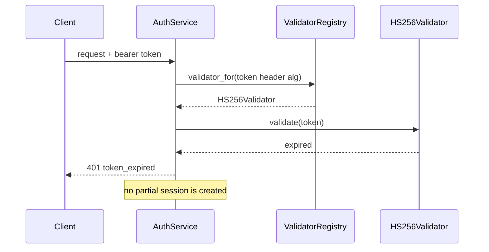
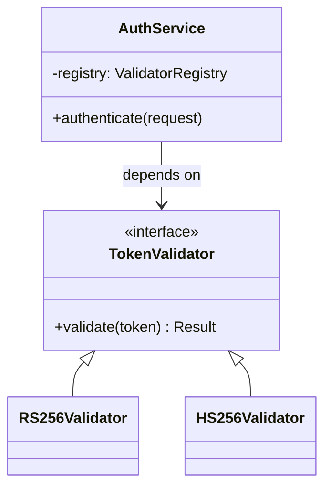

# Writing specs and plans

This is a worked example, not a new rule. Compass already has the rule:
**strategy S7** in `governance/strategies.md` says write for a cold reader -
someone who was not in the conversation, has not read the review, and cannot ask
you a follow-up question. This page shows what that looks like in the four
places it matters most.

It is aimed at whoever is writing or reviewing an artifact, human or agent. Read
it once; come back to the examples when something you wrote gets a puzzled
response.

The pattern in all four examples is the same. The weak version is not *wrong* -
it is usually accurate, and it was perfectly clear to the person who wrote it.
That is the trap. Clarity to the author is not the test. The test is whether the
next person can act on it without asking you a question.

---

## Example 1 - a spec Summary

Every `acceptance-criteria.md` opens with a Summary: **Goal**, **Approach**, and **Why
now / what changes**. It is the first thing a reviewer reads and often the only
thing they read closely.

**Weak**

> **Goal:** Improve the export.
>
> **Approach:** Refactor the export module and add the new fields.
>
> **Why now / what changes:** Users have asked for this.

**Better**

> **Goal:** Let finance produce a month-end ledger they can file without
> hand-editing it first.
>
> **Approach:** The export gains three columns finance currently adds by hand
> (cost centre, VAT code, reconciliation ref) and excludes draft entries, which
> are the main reason exports get re-run. The generation path is unchanged.
>
> **Why now / what changes:** Finance re-runs this export two or three times
> each month-end because drafts slip in. After this change the first export is
> the one they file, and the three columns they paste in by hand arrive
> populated.

**What changed:** the weak version could describe a hundred different changes;
the better one could only describe this change.

---

## Example 2 - a design decision

Design decisions live in `design.md` under `## 2. Design decisions`, ADR-style. A
decision with no alternative considered is usually not a decision yet - it is a
preference that has not been tested.

**Weak**

> ### DD-1 - Use a queue
>
> - **Context:** We need to handle the load.
> - **Decision:** Use a queue.
> - **Alternatives considered:** Doing it synchronously.
> - **Consequences:** Better performance.

**Better**

> ### DD-1 - Exports are generated on a queue, not in the request
>
> - **Context:** A month-end export for the largest account takes 40 to 90
>   seconds to build. The gateway times out at 30, so today it fails for
>   precisely the accounts that need it most.
> - **Decision:** The request enqueues a job and returns a job id immediately;
>   the client polls for the finished file.
> - **Alternatives considered:** Streaming the response, which keeps one request
>   but leaves a partial file on disconnect and does not fix the underlying
>   40-to-90-second build. Raising the gateway timeout, which moves the ceiling
>   without removing it and slows every other route behind the same proxy.
> - **Consequences:** Commits us to a job store and a polling endpoint. Clients
>   must handle a two-step flow, so the API is no longer a single call.
> - **Governance tie:** G1 - the job path needs its own test surface.

**What changed:** the weak version records that a choice was made; the better one
records enough for a future reader to reopen the choice when the constraints
change.

---

## Example 3 - a scenario name

Scenario names are read far more often than scenario bodies. A product owner
scanning a spec reads twenty names and three bodies.

**Weak**

> `Scenario: test export`
>
> `Scenario: check the token logic`
>
> `Scenario: it should work correctly`

**Better**

> `Scenario: a draft entry should be excluded from the month-end export`
>
> `Scenario: an expired reset token should be rejected`
>
> `Scenario: an export for an account with no entries should return an empty file, not an error`

**What changed:** the names now state an outcome rather than a call path, so the
spec can be scanned without opening a single scenario body.

---

## Example 4 - a plan work unit

Work units in `design.md` are what Build actually executes. A unit that reads
clearly to the planner and vaguely to the builder is the most expensive kind of
plan defect, because the ambiguity is discovered after the work starts.

**Weak**

> | Unit | Scenario group(s) | Code surface | Independent of |
> |---|---|---|---|
> | U1 | group A | the export code | U2 |
> | U2 | similar to U1 | TBD | U1 |
>
> Write tests for the above.

**Better**

> | Unit | Scenario group(s) | Code surface | Independent of |
> |---|---|---|---|
> | U1 | group A - TRC-A1, TRC-A2 | `src/export/ledger.py`, `src/export/columns.py` | U2 - disjoint files and disjoint scenarios |
> | U2 | group B - TRC-B1 | `src/jobs/queue.py`, `src/api/jobs.py` | U1 - as above |
>
> Tests: `tests/test_ledger_export.py::test_excludes_drafts`,
> `tests/test_jobs.py::test_returns_job_id`.

**What changed:** every cell that a builder would have had to ask about is
filled in, and the independence claim now says *why* rather than asserting it.

`compass design lint` catches the most mechanical version of this - `TBD`, `TODO`,
"implement later", "add appropriate error handling", and work units that promise
tests without naming any. It is advisory and always exits 0, so it reports and
you judge. It cannot catch "similar to U1", which needs a reader.

---

## A worked plan - every optional section rendered

<!-- Deliberately not "## Example 5". The numbered examples above are
     weak-then-strong pairs of a single passage; this is one complete artifact
     rendered end to end, which is a different kind of thing. Keeping it out of
     that series leaves the pairing convention intact. -->

`templates/design.md` offers five optional sections beyond Approach, design
decisions, the governance check, and work units: a **Summary**, an
**interaction** diagram, a **structure** diagram, **named design patterns**,
and **the shape of the change** in code. They exist so a reviewer can see a
design before it is built, which is the cheapest moment to disagree with it.

They are optional individually. `skills/plan-authoring/SKILL.md` carries the
rule for each; the short version is that Express writes no plan at all,
Standard uses the one or two that add clarity, and Expedition may use all of
them. **Delete the ones you do not use** - an empty optional heading reads as
an omission rather than a decision.

Below is a complete worked example for an imaginary task: adding support for a
second JWT signing algorithm. Note what it does *not* do - it names two
patterns, not five, and it shows an interface rather than an implementation.

---

### 0. Summary

**Goal:** Accept tokens signed with HMAC as well as RSA, so partners who
cannot manage a key pair can still integrate.

**Approach:** Introduce a `TokenValidator` interface with one implementation
per algorithm, selected by the token header. `AuthService` depends on the
interface and stops knowing about algorithms at all.

**Why now / what changes:** Two partners are blocked on RSA key management.
Afterwards an integrator can sign with a shared secret, and adding a third
algorithm is a new class rather than a new branch in `AuthService`.

### 2. Interaction - sequence diagram



The failure path is the reason this diagram is here: the 401 must be returned
before any session row is written, and that ordering is not visible in prose.

### 3. Structure - what talks to what



This commits us to algorithm selection happening in one place. It deliberately
leaves open how a validator is configured; that stays in the existing config
loader.

### 4. Design patterns invoked

> - **Strategy** (GoF) - `TokenValidator` lets `AuthService` swap signature
>   algorithms without knowing which is in play. Earns its keep because we
>   already ship RS256, are adding HS256 now, and EdDSA is on the roadmap:
>   three variants is where a conditional stops being cheaper than a type.
> - **Registry** - `ValidatorRegistry` maps an algorithm name to its
>   validator. Earns its keep because the mapping is data the config already
>   owns, and putting it in a registry keeps `AuthService` free of a lookup
>   table that would need a test per entry.

Two patterns, both with a reason. There is no Factory here and no Ports and
Adapters: naming them would make this plan sound more considered without
making it clearer, and a reviewer cannot disagree with a bare name.

### 5. The shape of the change

```python
class TokenValidator(Protocol):
    def validate(self, token: str) -> Result: ...

class ValidatorRegistry:
    def validator_for(self, alg: str) -> TokenValidator: ...

class AuthService:
    def __init__(self, registry: ValidatorRegistry): ...
    def authenticate(self, request) -> Claims: ...
```

Push back here if you think `validate` should return claims directly rather
than a `Result` - that choice decides whether an expired token is an exception
or a value, and it is easier to change now than after four call sites exist.

---

**On PlantUML.** Both diagrams above are Mermaid, which renders natively in
GitHub and in every modern IDE viewer. PlantUML is the documented fallback for
the shapes Mermaid cannot express - component diagrams with lifelines, state
charts with guards, deployment topology. Reach for it only then: it needs a
rendering path the reader may not have, so some readers will see source
instead of a picture.

---

## What Compass deliberately does not adopt

These are decisions, not omissions. They are written down because an unstated
boundary gets re-litigated every few months, whereas a stated one gives the next
person something specific to argue with.

**No subagent review loop between spec and plan.** The obvious way to improve a
spec is to have a second agent critique it. The evidence against it is not
Compass's own: the Superpowers project shipped such a loop, then removed it in
their v5.0.6 release after regression testing across five versions and five
trials found identical quality scores whether the loop ran or not, at roughly 25
minutes of overhead per run. Compass has not repeated that measurement, and
takes their published result at face value. Compass already has two
review moments that earn their cost: **Clarify**, which QAs the spec against
governance and records an ambiguity ledger, and the **reviewer** agent at Verify.
The four-scan self-review in the `bdd-specification` skill gets the ergonomic
benefit without the ceremony, because the author fixes their own cheap mistakes
rather than routing them through a critic.

**No user-story format as the spec.** "As a [role], I want [feature], so that
[outcome]" is refused as a spec format by **ADR-004**. The reason is that a user
story embeds one role's perspective into the artifact, so each role ends up
wanting their own version and the versions drift. Compass has one
`acceptance-criteria.md` that five roles read through five lenses. User stories are
fine *upstream* of Compass, in a brief or a ticket; they are not the spec.

**No single-audience declaration.** A common convention is to write "assume the
reader is a junior engineer with no context". Compass does not, because its
five-lens model is a stronger reader model than any single persona: the same
spec is read for intent fidelity, for claims, for tests, for coverage, and for UI
behaviour. S7 already assumes zero prior context without having to name someone
to imagine.

**No bite-sized tasks with exact commands in the plan.** Some frameworks make
the plan a sequence of small steps each with the literal command to run. Compass
does not, because Build already sequences small units through `compass tdd-red`
and `compass tdd-green`, and duplicating that in `design.md` inflates the plan
while making it stale the moment the code moves. The useful part of that idea -
that a plan should contain no unfinished promises - is kept, as `compass plan
lint`.

---

## Related

- `governance/strategies.md` - S7 (cold reader) and S4 (persistence over
  conversation), which S7 extends.
- `skills/bdd-specification/SKILL.md` - the Summary section, the four-scan
  self-review, and what makes a scenario runnable.
- `skills/governance-check/SKILL.md` - where `compass design lint` fits in the
  strategies walk.
- `architecture/decisions/ADR-004-one-spec-many-lenses.md` - why the spec is one
  artifact rather than one per role.
