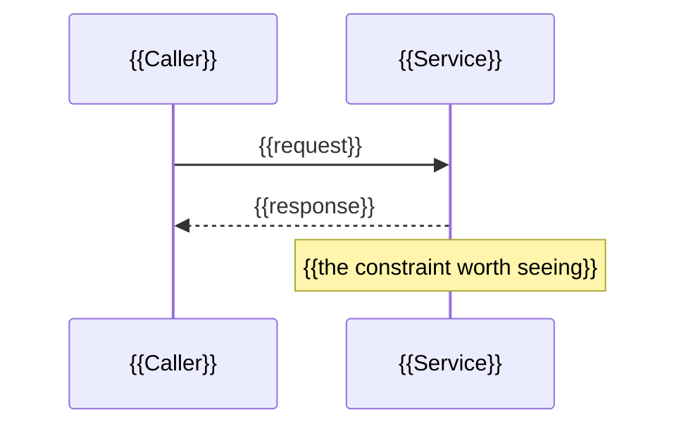

<!--
TEMPLATE: design.md
Produced by: the design stage (`/compass:design`); owning agent `planner`.
Lives at:    .compass/work/<task-slug>/design.md
Role in the pipeline: the technical plan. Records the approach, the design
decisions as ADR-style notes, the governance check against all of
governance/, and the independent work units. On a quick fix or hotfix, the design stage
collapses to a one-line note in delivery-approach.md and this file is not written; on
Spike it collapses to a timebox sketch in delivery-approach.md. On Standard this is a
real file; on initiative-scale work it is paired with distribution-map.md.

The governance check here is run by the `governance-check` skill. How to
choose and write the sections below is the `plan-authoring` skill.

SECTIONS 0 AND 2-5 ARE OPTIONAL. They exist so a reviewer can *see* the shape
of a change before it is built - an interaction, a structure, a named pattern,
the shape of a key type. Used well they replace paragraphs of prose. Used
badly they are padding, and a padded plan is read less carefully than a short
one. Each carries its own rule for when it earns a place; follow the rule
rather than filling every heading. Delete the ones you do not use - an empty
optional section is worse than an absent one.

Roughly: a quick fix writes no design.md at all; a feature uses the one or two that
add clarity; initiative-scale work may use all of them, because there this file IS the
design document.

Fill every {{PLACEHOLDER}} in the sections you keep.
-->

# Plan - {{TASK_SLUG}}

> **Phase:** Plan · **Date:** {{DATE}} · **Owning agent:** planner
> **Plan weight (from delivery-approach.md):** {{real design.md \| design.md + distribution-map.md}}

---

## 0. Summary

<!-- OPTIONAL, and the one most often worth keeping. Include when a reader
     who did not write this plan needs to know what it delivers before
     judging how. Omit on a plan short enough that section 1 already is the
     summary - restating three paragraphs in three paragraphs helps nobody.

     Three fields, same shape and same reason as the Summary in
     acceptance-criteria.md: a reader who has learned where to find it in one
     artifact finds it in the same place in the other. This is the
     write-for-a-cold-reader strategy applied to the design. -->

**Goal:** {{One sentence - what this change delivers, in user terms.}}

**Approach:** {{Two to three sentences - the shape of the change. Enough that
a reader can predict what the work units at the end will be.}}

**Why now / what changes:** {{One short paragraph - what is visibly different
afterwards, and for whom. If nothing observable changes, say so and say what
does.}}

---

## 1. Approach

<!-- The technical approach in a few paragraphs. How the scenarios in
     acceptance-criteria.md get satisfied. What changes, where, in what order. -->

{{APPROACH}}

---

## 2. Interaction - sequence diagram

<!-- OPTIONAL. Include when the change touches two or more collaborating
     components and the order of their exchanges matters. Omit for a change
     inside a single component - a sequence diagram of one participant
     talking to itself is noise.

     Mermaid renders natively in GitHub and every modern IDE viewer, so it is
     the default. Reach for PlantUML only when Mermaid genuinely cannot
     express the shape - component-with-lifelines, state charts with guards,
     deployment topology. -->



{{One or two lines on what the diagram shows that the prose does not - usually
the failure path, or the step where ordering constrains the design.}}

---

## 3. Structure - what talks to what

<!-- OPTIONAL. Include when introducing new components, changing the
     relationships between existing ones, or spelling out a module or class
     contract the work units assume. Omit when the change adds no new
     boundary - a diagram of code that already exists, unchanged, teaches
     nothing.

     Mermaid classDiagram covers most needs; use PlantUML only where Mermaid
     cannot express what you need. -->

```mermaid
classDiagram
    class {{Interface}} {
        <<interface>>
        +{{method}}() {{Result}}
    }
    class {{Implementation}}
    {{Interface}} <|-- {{Implementation}}
```

{{What the structure commits you to, and what it deliberately leaves open.}}

---

## 4. Design patterns invoked

<!-- OPTIONAL, and the easiest of the five to misuse. Include ONLY when a
     real, named pattern is genuinely being applied - a GoF pattern, a DDD
     pattern, a named architectural style. If you cannot name the pattern, do
     not invoke this section; and if you can name it but cannot say what it
     buys *this* change, omit it too.

     Each entry needs a reason. A pattern name with no reason is
     name-dropping: it makes a plan sound considered without making it
     clearer, and a reviewer cannot disagree with a bare name. Two justified
     patterns beat five decorative ones. -->

> - **{{Pattern name}}** ({{GoF / DDD / architectural}}) - {{what it does
>   here}}. Earns its keep because {{the concrete reason - an existing
>   variant, a boundary you mock, a change you expect}}.
> - **{{Pattern name}}** - {{…}}. Earns its keep because {{…}}.

---

## 5. The shape of the change

<!-- OPTIONAL. Include when the shape of an interface, a type, or an API is
     itself a design decision a reviewer should be able to argue with before
     it is built. Omit when the shape is obvious from section 1, and omit when
     you find yourself writing the implementation - this is a sketch of the
     contract, not the work. Build writes the code.

     Show the signature and the boundary; leave the body as `...` unless the
     body IS the decision. -->

```{{language}}
{{The interface, type, or signature whose shape is the decision.}}
```

{{One or two lines on what a reviewer should push back on if they disagree.}}

---

## 6. Design decisions (ADR-style)

<!-- One block per real design decision. A decision with no alternative
     considered is usually not a decision yet. A quick fix has none of these by
     definition; if you have one, the approach was mis-sized - re-assess. -->

### DD-1 - {{DECISION TITLE}}

- **Context:** {{what forced a choice}}
- **Decision:** {{what was chosen}}
- **Alternatives considered:** {{what else, and why not}}
- **Consequences:** {{what this commits us to; what it rules out}}
- **Governance tie:** {{which guardrail or engineering strategy this honours - or "n/a"}}

### DD-2 - {{DECISION TITLE}}

- **Context:** {{…}}
- **Decision:** {{…}}
- **Alternatives considered:** {{…}}
- **Consequences:** {{…}}
- **Governance tie:** {{…}}

---

## 7. Governance check

<!-- Run against ALL of governance/ - guardrails.md, strategies.md, and
     routing-policy.md. A failed guardrail here blocks the phase - fix the
     plan, do not note the violation and move on. A strategy not followed is
     a recorded judgement, not an automatic block. This is the
     `governance-check` skill's output. Keep the evidence side and the
     judgement side visibly separate. -->

| Area | Result | Evidence / note |
|---|---|---|
| Guardrails (the five defaults + project) | {{pass \| fail}} | {{e.g. "acceptance criteria stated before implementation; traceability chains designed in; coverage targets the guardrail floor"}} |
| Method strategies (defaults + project) | {{followed \| deviation recorded}} | {{e.g. "BDD + TDD apply; simplest-thing honoured. Any deviation noted with its reason."}} |
| Product strategies | {{followed \| deviation recorded \| n/a}} | {{e.g. "plan delivers prd.md's outcome; honours the no-dark-patterns strategy"}} |
| Voice & positioning strategies | {{followed \| deviation recorded \| n/a}} | {{n/a unless marketer in play; if so, claims traceable}} |
| Routing policy | {{pass \| fail}} | {{plan does not require skipping anything delivery-approach.md kept; floors honoured}} |

---

## 8. Work units

<!-- The independent (or shared-surface) units of work. On Standard this is
     a short list; on initiative-scale work it becomes the input to distribution-map.md.
     Independence = disjoint code AND disjoint scenario groups. -->

| Unit | Scenario group(s) it satisfies | Code surface it touches | Independent of |
|---|---|---|---|
| U1 | {{group A - TRC-A1, TRC-A2}} | {{files / modules}} | {{U2, U3 - or "shares surface with U2"}} |
| U2 | {{group B - TRC-B1}} | {{…}} | {{…}} |

**Parallelism assessment:** {{"U1 and U2 are genuinely independent → candidate pair/swarm" - or "all units share surface → solo"}}

---

## Gate

- [ ] Every scenario in `acceptance-criteria.md` is covered by a work unit.
- [ ] Governance check passes - every guardrail clears with evidence; any strategy deviation is recorded (above).
- [ ] If parallel work is possible, `distribution-map.md` is written next.

Next stage: **break down the work** (`/compass:breakdown`) - or straight to **implement** on solo work.
